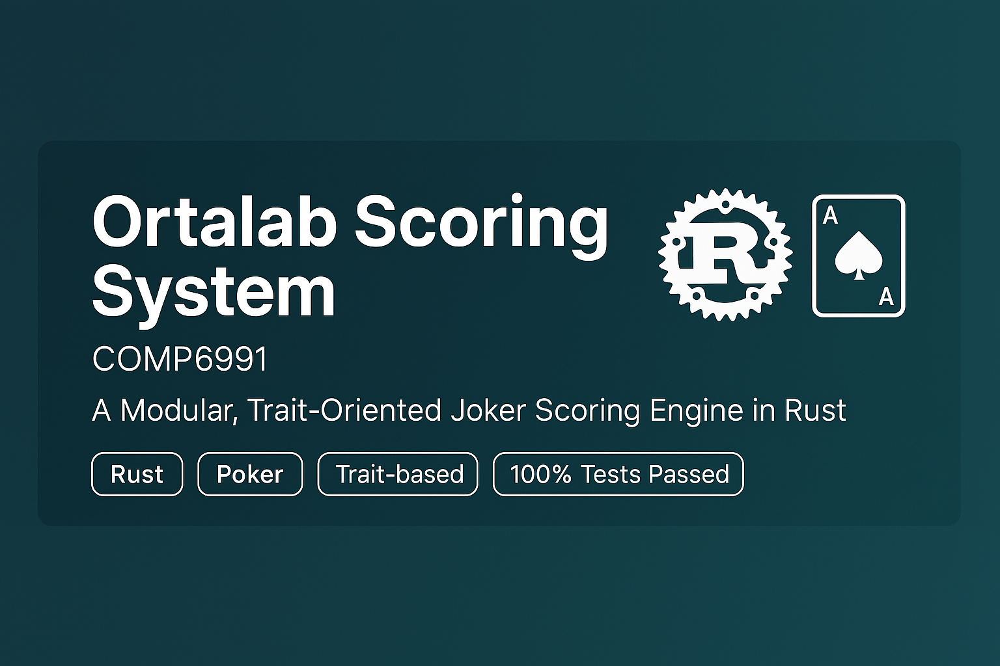
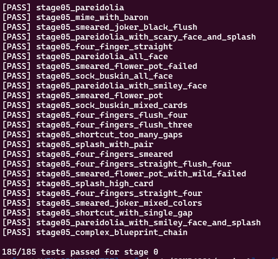

<!-- GitHub banner / 微信二维码区域 -->

  
  

<h1 align="center">🔥 6年全栈工程师 | 留学生编程导师 | 800+无差评</h1>

  <em>🚀 Helping CS international students ace their assignments, projects, and careers.</em>

---

## 🧠 关于我 | About Me

### 中文版介绍
> 🔥【6年全栈工程师 | 800+无差评护航 | 留学生编程全能导师】

- ✅ 覆盖50+编程语言（Python / Go / C++ / Bash 等）
- ✅ 精通 Linux 操作系统
- ✅ 贯通算法 / 数据结构 / 数据库 / 操作系统等核心课程
- ✅ 独创三步调试教学法，通过率98.7%
- ✅ 100%原创代码 & Turnitin 检测保障
- ✅ 7×12小时急速响应机制

🛠 服务范围：作业 / 报告 / 项目 / 毕设 / 面试  
🎯 学员战绩：326 Distinction | 47 First Class | 12 人入职 FAANG  
📲 微信联系我获取《编程思维提升指南》

---

### English Version

> 🔥 [6-Year Full-Stack Engineer | 800+ Perfect Reviews | Programming Mentor for International Students]

- ✅ Master of 50+ languages (Python, Go, C++, Bash, etc.)
- ✅ Expert in Linux, Algorithms, OS, DBMS
- ✅ Inventor of 3-Step Debugging System – 98.7% pass rate
- ✅ 100% original code – Turnitin-safe
- ✅ 7×12 quick-response tech support

🛠 Services: Assignments / Labs / Projects / Capstones / Interview prep  
🎯 Student wins: 326 Distinctions | 47 First-Class dissertations | 12 in FAANG  
📲 DM me on WeChat to get the “Programming Thinking Booster Guide”

---

## 📊 我的 GitHub 动态

---

## 🧩 项目成果展示 Projects Highlights

### 🎴 Ortalab Poker Scoring Engine (Rust)

  
   
  

---

## 📬 联系我 Contact

📍 微信 WeChat：`coder199608`  
📧 邮箱 Email：`bchengzhimei@163.com`  
🔒 原创保障 | 谢绝中介 | 支持平台担保
